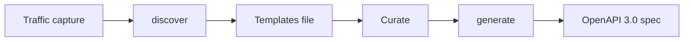

# Discover, curate, generate

<!-- toc -->

`mitm2openapi` uses a three-step pipeline to convert captured HTTP traffic into an OpenAPI
specification. This chapter explains each step in detail.

## Overview



The pipeline separates **endpoint discovery** from **spec generation**, giving you an explicit
curation step where you choose which endpoints appear in the final spec.

## Step 1: Discover

The `discover` command scans a traffic capture and extracts all unique URL paths that match
a given prefix.

```bash
mitm2openapi discover \
  -i capture.flow \
  -o templates.yaml \
  -p "https://api.example.com"
```

### What happens internally

1. The input file is read incrementally (streaming — memory usage stays bounded)
2. Each request's URL is checked against the `--prefix` filter
3. Matching paths are collected and deduplicated
4. Path segments that look like IDs (UUIDs, numeric strings) are replaced with
   `{id}` placeholders (or `{id1}`, `{id2}`, ... when a path has multiple parameters)
5. The result is written to the templates file

### Templates file format

The output is a YAML file with path templates under an `x-path-templates` key:

```yaml
x-path-templates:
- ignore:/api/users
- ignore:/api/users/{id}
- ignore:/api/products
- ignore:/api/products/{id}/reviews
- ignore:/static/bundle.js
```

Every path is prefixed with `ignore:` by default. This is intentional — it forces you to
explicitly opt in to each endpoint.

### Automatic parameterization

The discover step detects path segments that vary across requests and replaces them with
named parameters:

| Observed paths | Template |
|---|---|
| `/api/users/42`, `/api/users/99` | `/api/users/{id}` |
| `/api/orders/abc-def-123` | `/api/orders/{id}` |

UUID-like and numeric segments are detected automatically. More complex patterns require
manual editing of the templates file.

## Step 2: Curate

Open the templates file in any text editor. For each path:

- **Remove `ignore:`** to include the endpoint in the generated spec
- **Leave `ignore:`** to exclude it
- **Delete the line** to exclude it permanently

```yaml
# Before curation
x-path-templates:
- ignore:/api/users
- ignore:/api/users/{id}
- ignore:/static/bundle.js

# After curation
x-path-templates:
- /api/users
- /api/users/{id}
- ignore:/static/bundle.js
```

You can also edit parameter names. The default `{id}` placeholder can be renamed to
something more descriptive like `{userId}`:

```yaml
- /api/users/{userId}
```

### Automating curation with glob filters

For CI pipelines or large captures, manual curation is impractical. Use `--include-patterns`
and `--exclude-patterns` during the `discover` step instead:

```bash
mitm2openapi discover \
  -i capture.flow \
  -o templates.yaml \
  -p "https://api.example.com" \
  --include-patterns '/api/**' \
  --exclude-patterns '/static/**,*.css,*.js'
```

Paths matching `--include-patterns` are emitted without the `ignore:` prefix (auto-activated).
Paths matching `--exclude-patterns` are dropped entirely. Everything else gets `ignore:` for
manual review.

See [filtering endpoints](./filtering.md) for the full glob syntax.

## Step 3: Generate

The `generate` command re-reads the traffic capture and produces an OpenAPI spec using the
curated templates as a guide:

```bash
mitm2openapi generate \
  -i capture.flow \
  -t templates.yaml \
  -o openapi.yaml \
  -p "https://api.example.com"
```

### What happens internally

1. The templates file is loaded and the `ignore:` entries are filtered out
2. Each template path is compiled into a regex for matching
3. The traffic capture is streamed again, matching each request against the templates
4. For each matched request:
   - Path parameters are extracted
   - Query parameters are collected
   - Request body schema is inferred (JSON, form data)
   - Response status code and body schema are recorded
5. When multiple requests match the same template, their schemas are merged:
    - Different status codes (200, 400, 404) produce separate response entries
    - Request body is taken from the first observation; subsequent same-endpoint
      observations only contribute response schemas
6. The final OpenAPI 3.0 document is written as YAML

### Customizing output

The `generate` command accepts several options to tune the output:

```bash
mitm2openapi generate \
  -i capture.flow \
  -t templates.yaml \
  -o openapi.yaml \
  -p "https://api.example.com" \
  --openapi-title "My API" \
  --openapi-version "2.0.0" \
  --exclude-headers "authorization,cookie" \
  --ignore-images
```

See the [CLI reference](./cli-reference.md) for all available options.

## Worked example

Starting from a mitmproxy capture of a pet store API:

```bash
# Discover all endpoints under the API prefix
mitm2openapi discover \
  -i petstore.flow \
  -o templates.yaml \
  -p "http://petstore:8080" \
  --exclude-patterns '/static/**' \
  --include-patterns '/api/**'

# Templates file now has API paths auto-activated:
#   - /api/v3/pet
#   - /api/v3/pet/{id}
#   - /api/v3/pet/findByStatus
#   - /api/v3/store/inventory
#   - ignore:/static/swagger-ui.css

# Generate the spec
mitm2openapi generate \
  -i petstore.flow \
  -t templates.yaml \
  -o openapi.yaml \
  -p "http://petstore:8080"

# Result: openapi.yaml with paths, methods, schemas
```

The generated `openapi.yaml` is a valid OpenAPI 3.0 document that can be opened in
[Swagger UI](https://github.com/swagger-api/swagger-ui), imported into Postman, or used
as a contract for API testing.
