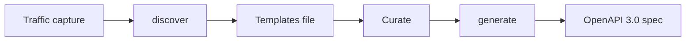

# Discover, curate, generate

<!-- toc -->

`mitm2openapi` uses a three-step pipeline to convert captured HTTP traffic into an OpenAPI
specification. This chapter explains each step in detail.

## Overview


```mermaid
graph LR
    A[Traffic capture] --> B[discover]
    B --> C[Templates file]
    C --> D[Curate]
    D --> E[generate]
    E --> F[OpenAPI 3.0 spec]
```

The pipeline separates **endpoint discovery** from **spec generation**, giving you an explicit
curation step where you choose which endpoints appear in the final spec.

## Step 1: Discover

The `discover` command scans a traffic capture and extracts all unique URL paths that match
a given prefix.

```bash
mitm2openapi discover \
  -i capture.flow \
  -o templates.yaml \
  -p "https://api.example.com"
```

### What happens internally

1. The input file is read incrementally (streaming — memory usage stays bounded)
2. Each request's URL is checked against the `--prefix` filter
3. Matching paths are collected and deduplicated
4. Path segments that look like IDs (UUIDs, numeric strings) are replaced with
   `{id}` placeholders (or `{id1}`, `{id2}`, ... when a path has multiple parameters)
5. The result is written to the templates file

### Templates file format

The output is a YAML file with path templates under an `x-path-templates` key:

```yaml
x-path-templates:
- ignore:/api/users
- ignore:/api/users/{id}
- ignore:/api/products
- ignore:/api/products/{id}/reviews
- ignore:/static/bundle.js
```

Every path is prefixed with `ignore:` by default. This is intentional — it forces you to
explicitly opt in to each endpoint.

### Automatic parameterization

The discover step detects path segments that vary across requests and replaces them with
named parameters:

| Observed paths | Template |
|---|---|
| `/api/users/42`, `/api/users/99` | `/api/users/{id}` |
| `/api/orders/abc-def-123` | `/api/orders/{id}` |

UUID-like and numeric segments are detected automatically. The following patterns are also
recognized:

- **UPPER_CASE slugs** — e.g. `BTC_USDT`, `ETH_BTC`
- **Hex strings** — segments starting with `0x`
- **Base58 identifiers** — alphanumeric segments 20+ characters long
- **Cross-request variability** — segments with 3 or more distinct values across requests

For patterns not covered by the built-in heuristics, use `--param-regex` to supply a custom
regex. Any path segment matching the regex is treated as a parameter:

```bash
mitm2openapi discover \
  -i capture.flow \
  -o templates.yaml \
  -p "https://api.example.com" \
  --param-regex '[A-Z]{2,}_[A-Z]{2,}'
```

## Step 2: Curate

Open the templates file in any text editor. For each path:

- **Remove `ignore:`** to include the endpoint in the generated spec
- **Leave `ignore:`** to exclude it
- **Delete the line** to exclude it permanently

```yaml
# Before curation
x-path-templates:
- ignore:/api/users
- ignore:/api/users/{id}
- ignore:/static/bundle.js

# After curation
x-path-templates:
- /api/users
- /api/users/{id}
- ignore:/static/bundle.js
```

You can also edit parameter names. The default `{id}` placeholder can be renamed to
something more descriptive like `{userId}`:

```yaml
- /api/users/{userId}
```

### Automating curation with glob filters

For CI pipelines or large captures, manual curation is impractical. Use `--include-patterns`
and `--exclude-patterns` during the `discover` step instead:

```bash
mitm2openapi discover \
  -i capture.flow \
  -o templates.yaml \
  -p "https://api.example.com" \
  --include-patterns '/api/**' \
  --exclude-patterns '/static/**,*.css,*.js'
```

Paths matching `--include-patterns` are emitted without the `ignore:` prefix (auto-activated).
Paths matching `--exclude-patterns` are dropped entirely. Everything else gets `ignore:` for
manual review.

See [filtering endpoints](./filtering.md) for the full glob syntax.

## Step 3: Generate

The `generate` command re-reads the traffic capture and produces an OpenAPI spec using the
curated templates as a guide:

```bash
mitm2openapi generate \
  -i capture.flow \
  -t templates.yaml \
  -o openapi.yaml \
  -p "https://api.example.com"
```

### What happens internally

1. The templates file is loaded and the `ignore:` entries are filtered out
2. Each template path is compiled into a regex for matching
3. The traffic capture is streamed again, matching each request against the templates
4. For each matched request:
   - Path parameters are extracted
   - Query parameters are collected
   - Request body schema is inferred (JSON, form data)
   - Response status code and body schema are recorded
5. When multiple requests match the same template, their schemas are merged:
    - Different status codes (200, 400, 404) produce separate response entries
    - Request body is taken from the first observation; subsequent same-endpoint
      observations only contribute response schemas
6. The final OpenAPI 3.0 document is written as YAML

### Customizing output

The `generate` command accepts several options to tune the output:

```bash
mitm2openapi generate \
  -i capture.flow \
  -t templates.yaml \
  -o openapi.yaml \
  -p "https://api.example.com" \
  --openapi-title "My API" \
  --openapi-version "2.0.0" \
  --exclude-headers "authorization,cookie" \
  --ignore-images
```

See the [CLI reference](./cli-reference.md) for all available options.

### Response and request examples

The `generate` step captures actual request and response bodies as named examples in the
OpenAPI spec. Each unique response per endpoint and status code is stored as a separate
example, up to the limit set by `--max-examples` (default: 5).

When multiple requests hit the same endpoint with different request bodies, the schemas are
merged using `oneOf` to represent all observed variants.

### Redacting sensitive data

Production captures often contain tokens, passwords, or PII. Use `--redact-patterns` and
`--redact-fields` to scrub sensitive values from examples before they land in the spec:

```bash
mitm2openapi generate \
  -i capture.flow \
  -t templates.yaml \
  -o openapi.yaml \
  -p "https://api.example.com" \
  --redact-patterns 'eyJ[\w-]+,sk-[a-zA-Z0-9]+' \
  --redact-fields 'password,token,secret,authorization'
```

`--redact-patterns` accepts comma-separated regexes matched against string values.
`--redact-fields` accepts comma-separated field names whose values are replaced with
`"[REDACTED]"`.

### Filtering OPTIONS requests

Both `discover` and `generate` accept `--skip-options` to exclude HTTP OPTIONS requests
(typically CORS preflight) from processing:

```bash
mitm2openapi discover -i capture.flow -o templates.yaml -p "https://api.example.com" --skip-options
```

## Worked example

Starting from a mitmproxy capture of a pet store API:

```bash
# Discover all endpoints under the API prefix
mitm2openapi discover \
  -i petstore.flow \
  -o templates.yaml \
  -p "http://petstore:8080" \
  --exclude-patterns '/static/**' \
  --include-patterns '/api/**'

# Templates file now has API paths auto-activated:
#   - /api/v3/pet
#   - /api/v3/pet/{id}
#   - /api/v3/pet/findByStatus
#   - /api/v3/store/inventory
#   - ignore:/static/swagger-ui.css

# Generate the spec
mitm2openapi generate \
  -i petstore.flow \
  -t templates.yaml \
  -o openapi.yaml \
  -p "http://petstore:8080"

# Result: openapi.yaml with paths, methods, schemas
```

The generated `openapi.yaml` is a valid OpenAPI 3.0 document that can be opened in
[Swagger UI](https://github.com/swagger-api/swagger-ui), imported into Postman, or used
as a contract for API testing.

## Generating stable operationIds

Use `--operation-id-strategy path` to generate camelCase operationIds that openapi-generator converts to readable Rust method names:

```sh
mitm2openapi generate -i capture.har -t templates.yaml -o openapi.yaml -p https://api.example.com \
  --operation-id-strategy path
```

This produces ids like `listUsers`, `getUser`, `createOrder`, `placeOrder`.

Override specific operations with a YAML file:

```yaml
# overrides.yaml
"GET /api/v1/contract/fair_price/{symbol}": getFairPrice
"POST /api/v1/private/order/place": placeOrder
```

```sh
mitm2openapi generate ... --operation-id-strategy path --operation-id-overrides overrides.yaml
```

## Organizing operations with tags

Tags group operations into modules (one Rust source file per tag in openapi-generator). Use regex-based rules:

```yaml
# tag-rules.yaml
rules:
  - match: "^/api/v1/contract/"
    tag: Contract
  - match: "^/api/v1/private/"
    tag: Private
default: Market
```

```sh
mitm2openapi generate ... --tag-rules tag-rules.yaml
```

Or use a fixed path segment as the tag:

```sh
mitm2openapi generate ... --tag-strategy path-segment --tag-segment-index 2
```

## MEXC-style envelope APIs

MEXC and similar exchange APIs always return HTTP 200 with a `success` boolean:

```json
{"success": true,  "data": {"price": 42000.5}}
{"success": false, "code": 1, "message": "Invalid symbol"}
```

Use `--envelope-discriminator` to split captured bodies into typed schemas:

```sh
mitm2openapi generate \
  -i capture.har -t templates.yaml -o openapi.yaml \
  -p https://api.example.com \
  --operation-id-strategy path \
  --tag-rules tag-rules.yaml \
  --envelope-discriminator success
```

The generated spec will include:

- A shared `components/schemas/ApiError` (inferred from all error bodies)
- Per-operation `{OperationId}Success` schemas
- `oneOf(SuccessSchema, ApiError)` for operations with mixed bodies

Supply your own error schema instead of inferring:

```sh
mitm2openapi generate ... \
  --envelope-discriminator success \
  --envelope-error-shape api-error.yaml
```
